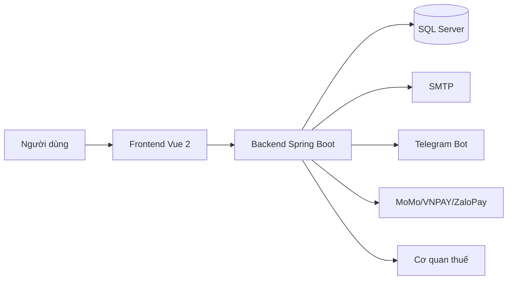
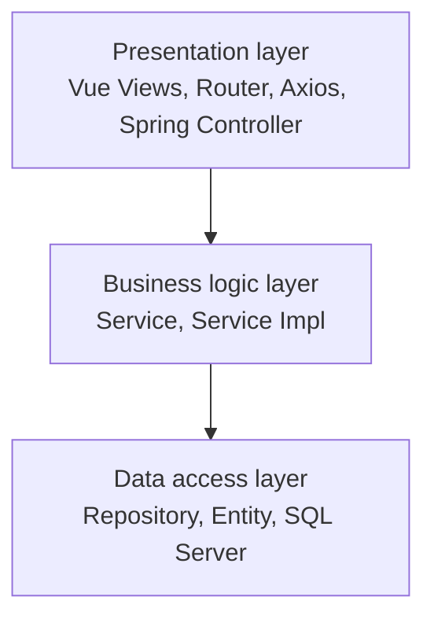
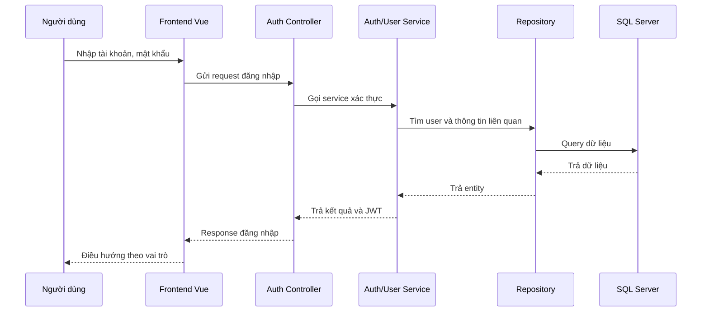
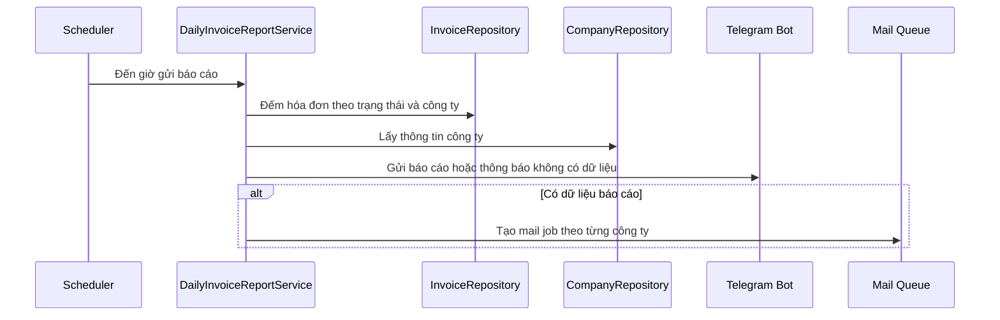

# Báo Cáo Và Kiểm Thử

Tài liệu gom hướng dẫn viết báo cáo, sơ đồ nên dùng và kiểm thử hệ thống.

## Nguồn đã hợp nhất

- `HUONG_DAN_VIET_BAO_CAO.md`
- `SO_DO_BAO_CAO.md`
- `KIEM_THU_HE_THONG.md`

## Nội dung

### Từ `HUONG_DAN_VIET_BAO_CAO.md`

Cập nhật: 19/06/2026.

Tài liệu này giúp người viết báo cáo biết nên lấy nội dung ở đâu và sắp xếp báo cáo như thế nào để trình bày đầy đủ hệ thống hóa đơn điện tử.

### Cấu trúc báo cáo đề xuất

| Chương | Nội dung nên viết | Tài liệu tham khảo |
| --- | --- | --- |
| 1. Mở đầu | Lý do chọn đề tài, mục tiêu, phạm vi, đối tượng sử dụng. | `docs/01_TONG_QUAN_HE_THONG.md`, `docs/01_TONG_QUAN_HE_THONG.md` |
| 2. Cơ sở lý thuyết | Hóa đơn điện tử, mô hình 03 lớp, Spring MVC REST, JWT, queue mail. | `docs/02_KIEN_TRUC_KY_THUAT.md`, `docs/02_KIEN_TRUC_KY_THUAT.md` |
| 3. Khảo sát và yêu cầu | Tác nhân, yêu cầu chức năng, yêu cầu phi chức năng. | `docs/01_TONG_QUAN_HE_THONG.md`, `docs/01_TONG_QUAN_HE_THONG.md` |
| 4. Phân tích thiết kế | Kiến trúc, luồng xử lý, database, phân quyền, bảo mật. | `docs/02_KIEN_TRUC_KY_THUAT.md`, `docs/02_KIEN_TRUC_KY_THUAT.md`, `04_PHAN_QUYEN_VA_VALIDATE.md` |
| 5. Cài đặt chương trình | Công nghệ, cấu trúc thư mục, API, cấu hình chạy. | `docs/02_KIEN_TRUC_KY_THUAT.md`, `docs/02_KIEN_TRUC_KY_THUAT.md`, `docs/API_01_TONG_QUAN_HE_THONG.md`, `docs/03_API_CAU_HINH_VAN_HANH.md` |
| 6. Chức năng chính | Mô tả màn hình và luồng nghiệp vụ. | `docs/01_TONG_QUAN_HE_THONG.md`, `docs/01_TONG_QUAN_HE_THONG.md` |
| 7. Sơ đồ minh họa | Kiến trúc, use case, 03 lớp, sequence, ERD. | `docs/07_BAO_CAO_VA_KIEM_THU.md`, `db.dbml`, `db.dbdiagram` |
| 8. Kiểm thử | Test case, kết quả mong đợi, lỗi cần chú ý. | `docs/07_BAO_CAO_VA_KIEM_THU.md`, `04_PHAN_QUYEN_VA_VALIDATE.md` |
| 9. Kết luận | Kết quả đạt được, hạn chế, hướng phát triển. | Tổng hợp từ các tài liệu trên. |

### Cách mô tả mô hình chương trình

Có thể viết:

> Hệ thống được xây dựng theo mô hình ứng dụng web 3 tầng gồm tầng giao diện Vue, tầng xử lý nghiệp vụ Spring Boot và tầng dữ liệu SQL Server. Riêng backend Java áp dụng mô hình 03 lớp gồm Presentation layer, Business logic layer và Data access layer trên nền Spring MVC REST.

Khi cần giải thích 03 lớp:

- Presentation layer: giao diện Vue và Controller backend.
- Business logic layer: Service xử lý nghiệp vụ, quyền, vai trò và phạm vi công ty.
- Data access layer: Repository, Entity và SQL Server.

### Chức năng nên đưa vào báo cáo

- Đăng ký công ty và duyệt hồ sơ.
- Đăng nhập, JWT, phiên đăng nhập và phân quyền.
- Quản lý hồ sơ công ty, thành viên, bảo mật IP.
- Quản lý mẫu hóa đơn, tờ khai và hóa đơn GTGT.
- Import hóa đơn, khách hàng và sản phẩm từ Excel.
- Ký hóa đơn, gửi cơ quan thuế, xem XML/PDF.
- Gửi email hóa đơn và hàng đợi mail.
- Báo cáo hóa đơn và báo cáo hóa đơn ngày qua Telegram/email.
- Mua gói hóa đơn và thanh toán.
- Khi trình bày thanh toán, ghi rõ MoMo và ZaloPay đang dùng bộ key sandbox/demo public của nhà cung cấp để kiểm thử tích hợp; production phải thay bằng thông tin merchant thật và URL callback public.
- Tra cứu hóa đơn công khai.

### Nội dung cần có khi viết phần database

- Giới thiệu SQL Server là database chính.
- Nêu các nhóm bảng: công ty, người dùng, phân quyền, hóa đơn, chữ ký/XML, mail, báo cáo, thanh toán, danh mục nền.
- Nhấn mạnh nguyên tắc dữ liệu nhiều công ty theo `company_id`.
- Dẫn nguồn schema từ `db.dbml` và `db.dbdiagram`.

### Nội dung cần có khi viết phần bảo mật

- JWT và tách token user/admin.
- Kiểm tra phiên đăng nhập bằng `login_sessions`.
- Phân quyền theo `permissions`, `permission_categories`, `user_permissions`.
- Phạm vi công ty theo `company_id`.
- Bảo mật IP theo công ty.
- Mã hóa mật khẩu SMTP và Telegram bot token.
- Public API chỉ mở cho chức năng cần thiết như tra cứu hóa đơn và callback thanh toán.

### Hướng phát triển có thể ghi trong báo cáo

- Tách quyền riêng cho báo cáo hóa đơn ngày thay vì dùng chung `telegram-config-manage`.
- Chuẩn hóa migration database thay cho phụ thuộc `ddl-auto=update`.
- Bổ sung test tự động cho service quan trọng.
- Bổ sung audit log chi tiết hơn cho thao tác phát hành hóa đơn.
- Bổ sung dashboard quản trị sâu hơn theo công ty, gói hóa đơn và trạng thái gửi cơ quan thuế.
- Chuẩn hóa validate độ dài field theo database trên toàn bộ frontend.

### Từ `SO_DO_BAO_CAO.md`

Cập nhật: 19/06/2026.

Tài liệu này gợi ý các sơ đồ nên đưa vào báo cáo để người đọc hiểu hệ thống nhanh hơn.

### Danh sách sơ đồ đề xuất

| Sơ đồ | Mục đích | Nguồn dữ liệu |
| --- | --- | --- |
| Sơ đồ kiến trúc tổng thể | Thể hiện frontend, backend, database và tích hợp ngoài. | `docs/02_KIEN_TRUC_KY_THUAT.md`, `docs/02_KIEN_TRUC_KY_THUAT.md` |
| Sơ đồ mô hình 03 lớp | Thể hiện Presentation, Business logic, Data access. | `docs/02_KIEN_TRUC_KY_THUAT.md` |
| Use case diagram | Thể hiện tác nhân và chức năng chính. | `docs/01_TONG_QUAN_HE_THONG.md` |
| ERD/database diagram | Thể hiện bảng và quan hệ dữ liệu. | `db.dbml`, `db.dbdiagram`, `docs/02_KIEN_TRUC_KY_THUAT.md` |
| Sequence đăng nhập | Mô tả luồng Vue -> Controller -> Service -> Repository -> Database. | `docs/02_KIEN_TRUC_KY_THUAT.md`, `docs/01_TONG_QUAN_HE_THONG.md` |
| Sequence lập/phát hành hóa đơn | Mô tả luồng tạo hóa đơn, ký, gửi cơ quan thuế. | `docs/01_TONG_QUAN_HE_THONG.md` |
| Sequence thanh toán gói hóa đơn | Mô tả luồng chọn gói, tạo giao dịch, mở cổng thanh toán, nhận callback và cộng hạn mức. | `docs/06_THANH_TOAN.md` |
| Sequence báo cáo hóa đơn ngày | Mô tả scheduler, Telegram, mail job. | `docs/01_TONG_QUAN_HE_THONG.md`, `docs/API_01_TONG_QUAN_HE_THONG.md` |
| Sơ đồ phân quyền | Mô tả Quản trị viên toàn quyền, Quản trị viên hệ thống, Quản lý doanh nghiệp, Nhân viên doanh nghiệp và permission. | `04_PHAN_QUYEN_VA_VALIDATE.md` |

### Sơ đồ kiến trúc tổng thể



### Sơ đồ mô hình 03 lớp



### Sequence đăng nhập



### Sequence báo cáo hóa đơn ngày



### Ghi chú khi đưa sơ đồ vào báo cáo

- Không cần đưa toàn bộ bảng database nếu sơ đồ quá lớn; có thể tách theo nhóm bảng.
- Use case diagram chỉ nên đưa chức năng chính, tránh quá dày.
- Sequence diagram nên chọn 2 đến 4 luồng tiêu biểu: đăng nhập, lập hóa đơn, import hóa đơn hoặc import danh mục, thanh toán gói, báo cáo ngày.
- Nếu dùng Mermaid trong Markdown, có thể chụp lại sơ đồ để đưa vào file Word/PDF.

### Từ `KIEM_THU_HE_THONG.md`

Cập nhật: 19/06/2026.

Tài liệu này mô tả các nhóm kiểm thử và test case tiêu biểu để dùng trong báo cáo.

### Nhóm kiểm thử

| Nhóm | Mục tiêu |
| --- | --- |
| Kiểm thử chức năng | Đảm bảo các chức năng chính chạy đúng nghiệp vụ. |
| Kiểm thử phân quyền | Đảm bảo user chỉ thao tác đúng quyền và đúng công ty. |
| Kiểm thử validate | Đảm bảo dữ liệu nhập được kiểm tra ở frontend và backend. |
| Kiểm thử tích hợp | Đảm bảo các phần như mail, Telegram, thanh toán, XML phối hợp đúng. |
| Kiểm thử hồi quy | Đảm bảo sửa chức năng mới không làm hỏng luồng cũ. |

### Test case tiêu biểu

| Mã | Chức năng | Dữ liệu/Điều kiện | Kết quả mong đợi | Loại kiểm thử | Trạng thái |
| --- | --- | --- | --- | --- | --- |
| TC01 | Đăng nhập user | Tài khoản/mật khẩu đúng | Đăng nhập thành công, nhận JWT, vào dashboard công ty. | Thủ công/API | Chưa ghi nhận kết quả trong tài liệu. |
| TC02 | Đăng nhập sai mật khẩu | Mật khẩu sai | Hệ thống báo lỗi, không tạo phiên đăng nhập hợp lệ. | Thủ công/API | Chưa ghi nhận kết quả trong tài liệu. |
| TC03 | Phân quyền nhân viên | User thiếu quyền `invoice-save` | Không được lập hóa đơn, thông báo rõ quyền thiếu. | Thủ công/API | Chưa ghi nhận kết quả trong tài liệu. |
| TC04 | Tạo hóa đơn GTGT | Dữ liệu người mua và dòng hàng hợp lệ | Hóa đơn nháp được tạo đúng công ty. | Thủ công/API | Chưa ghi nhận kết quả trong tài liệu. |
| TC05 | Tạo hóa đơn thiếu dòng hàng | Không có dòng hàng hợp lệ | Hệ thống báo lỗi và không lưu hóa đơn. | Thủ công/API | Chưa ghi nhận kết quả trong tài liệu. |
| TC06 | Phát hành hóa đơn một thuế suất | Mẫu `form_invoices.type = 1`, dữ liệu thuế hợp lệ | XML và trạng thái hóa đơn xử lý đúng. | Tự động/thủ công | Có test XML, cần ghi kết quả chạy. |
| TC07 | Import Excel nhiều dòng hàng | Một hóa đơn có nhiều dòng hàng | Hệ thống gom đủ dòng hàng, không chỉ lấy dòng đầu tiên. | Thủ công/API | Chưa ghi nhận kết quả trong tài liệu. |
| TC08 | Gửi email hóa đơn | Cấu hình SMTP hợp lệ | Tạo mail job, worker gửi thành công, trạng thái `sent`. | Tự động/thủ công | Có test mail queue, cần ghi kết quả chạy. |
| TC09 | Báo cáo ngày không có dữ liệu | Không có hóa đơn cần kiểm tra | Telegram gửi thông báo không có hóa đơn; email không gửi. | Tự động/thủ công | Có test service, cần ghi kết quả chạy. |
| TC10 | Báo cáo ngày có dữ liệu | Có hóa đơn trạng thái cần kiểm tra | Telegram gửi báo cáo; email tạo theo từng công ty có dữ liệu. | Tự động/thủ công | Có test service, cần ghi kết quả chạy. |
| TC11 | Tra cứu hóa đơn public | Mã tra cứu hợp lệ | Hiển thị đúng hóa đơn được phép tra cứu. | Thủ công/API | Chưa ghi nhận kết quả trong tài liệu. |
| TC12 | Chặn dữ liệu công ty khác | User công ty A truy cập hóa đơn công ty B | Hệ thống từ chối hoặc không trả dữ liệu. | Thủ công/API | Chưa ghi nhận kết quả trong tài liệu. |
| TC13 | Mua gói qua ZaloPay sandbox | Chọn gói hóa đơn và phương thức `ZALOPAY` | Hệ thống tạo `order_url`, lưu `app_trans_id`, trạng thái giao dịch là `PENDING`. | Tự động/thủ công | Có test ZaloPay service, cần ghi kết quả chạy. |
| TC14 | Callback ZaloPay hợp lệ | Payload có `data`, `mac` đúng `key2`, số tiền khớp | Hệ thống cộng hạn mức hóa đơn và trả `return_code = 1`. | Tự động/API | Có test ZaloPay service, cần ghi kết quả chạy. |
| TC15 | Callback ZaloPay sai chữ ký | Payload có `mac` không khớp | Hệ thống từ chối callback, không cộng hạn mức hóa đơn. | Tự động/API | Có test ZaloPay service, cần ghi kết quả chạy. |
| TC16 | Thêm khách hàng trùng mã | Công ty đã có khách hàng mã `KH001`, tạo khách hàng khác cùng mã | Hệ thống báo trùng mã và không lưu bản ghi mới. | Thủ công/API | Chưa ghi nhận kết quả trong tài liệu. |
| TC17 | Thêm sản phẩm trùng mã | Công ty đã có sản phẩm mã `SP001`, tạo sản phẩm khác cùng mã | Hệ thống báo trùng mã và không lưu bản ghi mới. | Thủ công/API | Chưa ghi nhận kết quả trong tài liệu. |
| TC18 | Import danh mục cập nhật theo mã | File import có mã khách hàng/sản phẩm đã tồn tại trong công ty | Hệ thống cập nhật bản ghi hiện có và lưu lịch sử import đúng loại. | Thủ công/API | Chưa ghi nhận kết quả trong tài liệu. |
| TC19 | Import danh mục trùng mã trong file | File import có hai dòng cùng mã khách hàng hoặc mã sản phẩm | Hệ thống báo lỗi dòng dữ liệu, không import file lỗi. | Thủ công/API | Chưa ghi nhận kết quả trong tài liệu. |

Khi chạy kiểm thử thật, cần cập nhật thêm ngày chạy, môi trường, dữ liệu test, người test và bằng chứng như log, ảnh màn hình hoặc kết quả `./mvnw test`.

### Kiểm thử validate form

Tham khảo chi tiết tại `04_PHAN_QUYEN_VA_VALIDATE.md`. Các điểm cần kiểm:

- Form có `novalidate` nếu tự validate.
- Lỗi hiển thị bằng tiếng Việt.
- Email, số điện thoại, mã số thuế, ngày tháng đúng định dạng.
- API phụ không làm hỏng form chính nếu thiếu quyền phụ.
- Backend vẫn kiểm tra lại dữ liệu quan trọng trước khi lưu.

### Kiểm thử báo cáo hóa đơn ngày

Các trường hợp quan trọng:

- Lịch gửi tắt thì scheduler không gửi.
- Đến giờ gửi và chưa gửi ngày báo cáo thì scheduler gửi.
- Đã gửi ngày báo cáo thì không gửi lặp.
- Đổi giờ/phút hoặc bật lại lịch thì trạng thái lần gửi gần nhất được xử lý phù hợp.
- Email chỉ gửi khi có dữ liệu.
- Mail job lưu đúng công ty nhận nội dung.

### Kiểm thử import Excel

Các trường hợp quan trọng:

- File đúng mẫu và có một hóa đơn một dòng hàng.
- File đúng mẫu và có một hóa đơn nhiều dòng hàng.
- File có nhiều hóa đơn.
- File dùng mẫu một thuế suất.
- File thiếu thông tin người mua hoặc dòng hàng.
- File sai định dạng số tiền, thuế suất hoặc ngày.
- File import khách hàng đúng mẫu, tạo mới và cập nhật theo mã.
- File import sản phẩm đúng mẫu, tạo mới và cập nhật theo mã.
- File import danh mục có mã bị lặp trong cùng file.

### Lệnh hỗ trợ kiểm tra

Kiểm tra backend:

```bash
./mvnw test
```

Build backend:

```bash
./mvnw package
```

Build frontend:

```bash
npm run build
```

Kiểm tra markdown:

```bash
git diff --check
```
