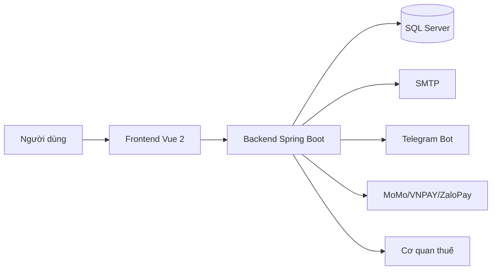
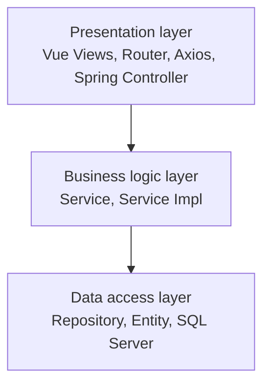
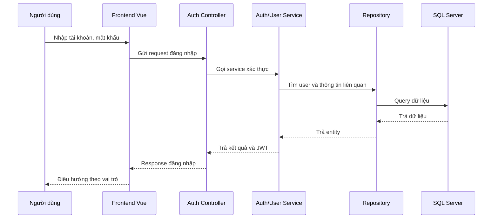
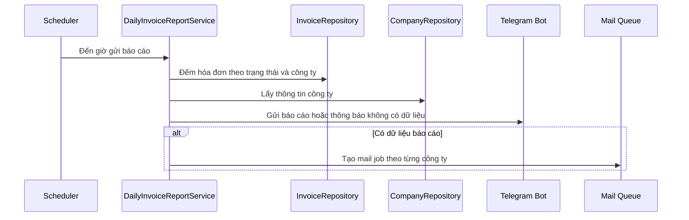

# Sơ đồ nên dùng trong báo cáo

Cập nhật: 18/06/2026.

Tài liệu này gợi ý các sơ đồ nên đưa vào báo cáo để người đọc hiểu hệ thống nhanh hơn.

## Danh sách sơ đồ đề xuất

| Sơ đồ | Mục đích | Nguồn dữ liệu |
| --- | --- | --- |
| Sơ đồ kiến trúc tổng thể | Thể hiện frontend, backend, database và tích hợp ngoài. | `docs/KIEN_TRUC.md`, `docs/CONG_NGHE.md` |
| Sơ đồ mô hình 03 lớp | Thể hiện Presentation, Business logic, Data access. | `docs/KIEN_TRUC.md` |
| Use case diagram | Thể hiện tác nhân và chức năng chính. | `docs/USE_CASE.md` |
| ERD/database diagram | Thể hiện bảng và quan hệ dữ liệu. | `db.dbml`, `db.dbdiagram`, `docs/CO_SO_DU_LIEU.md` |
| Sequence đăng nhập | Mô tả luồng Vue -> Controller -> Service -> Repository -> Database. | `docs/KIEN_TRUC.md`, `docs/USE_CASE.md` |
| Sequence lập/phát hành hóa đơn | Mô tả luồng tạo hóa đơn, ký, gửi cơ quan thuế. | `docs/LUONG_NGHIEP_VU.md` |
| Sequence báo cáo hóa đơn ngày | Mô tả scheduler, Telegram, mail job. | `docs/LUONG_NGHIEP_VU.md`, `docs/API_TONG_QUAN.md` |
| Sơ đồ phân quyền | Mô tả Root, admin công ty, nhân viên và permission. | `QUY_TAC_VAI_TRO_CHUONG_TRINH.md` |

## Sơ đồ kiến trúc tổng thể

## Sơ đồ mô hình 03 lớp

## Sequence đăng nhập

## Sequence báo cáo hóa đơn ngày

## Ghi chú khi đưa sơ đồ vào báo cáo

- Không cần đưa toàn bộ bảng database nếu sơ đồ quá lớn; có thể tách theo nhóm bảng.
- Use case diagram chỉ nên đưa chức năng chính, tránh quá dày.
- Sequence diagram nên chọn 2 đến 4 luồng tiêu biểu: đăng nhập, lập hóa đơn, import hóa đơn, báo cáo ngày.
- Nếu dùng Mermaid trong Markdown, có thể chụp lại sơ đồ để đưa vào file Word/PDF.
