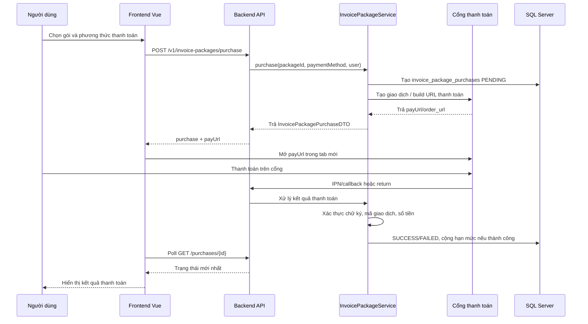
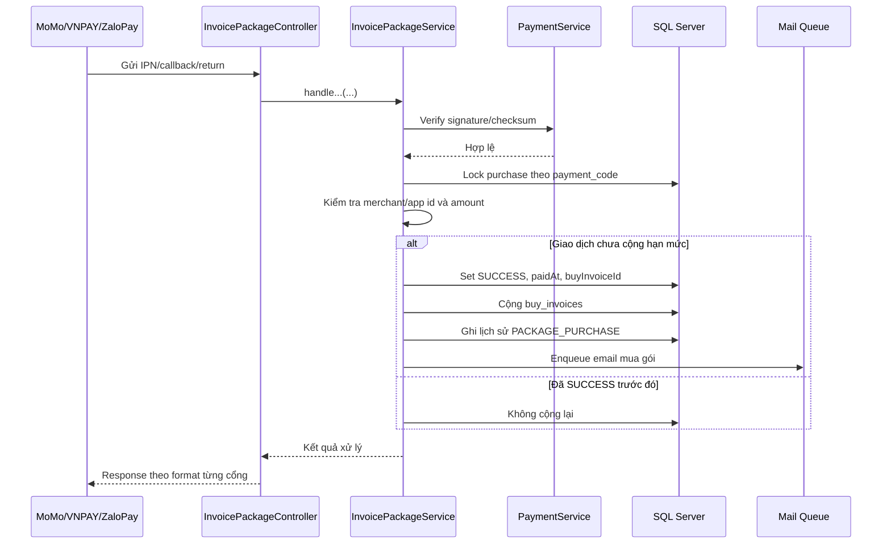

# Tích hợp thanh toán MoMo, VNPAY và ZaloPay

Cập nhật: 19/06/2026.

Tài liệu này mô tả toàn bộ cách hệ thống tích hợp ba cổng thanh toán MoMo, VNPAY và ZaloPay cho chức năng mua gói hóa đơn. Mục tiêu là để người mới đọc có thể hiểu được cấu hình nằm ở đâu, luồng thanh toán chạy như thế nào, backend ký và xác thực dữ liệu ra sao, callback cập nhật giao dịch như thế nào, và khi triển khai thật cần thay đổi những gì.

## 1. Phạm vi tích hợp

Thanh toán trong project hiện phục vụ màn hình khách hàng mua gói hóa đơn tại `/invoice-packages`.

Khi thanh toán thành công, hệ thống:

1. Cập nhật giao dịch trong bảng `invoice_package_purchases`.
2. Cộng hạn mức hóa đơn vào bảng `buy_invoices`.
3. Ghi lịch sử thay đổi hạn mức.
4. Kích hoạt công ty nếu công ty đang ở trạng thái chờ kích hoạt.
5. Đưa email thông báo mua gói vào hàng đợi gửi mail.

Các cổng đang hỗ trợ:

| Cổng | Mục đích | Trạng thái |
| --- | --- | --- |
| MoMo | Thanh toán qua ví, ATM nội địa, thẻ quốc tế, trả sau | Sandbox/demo, có thể đổi sang merchant thật bằng biến môi trường |
| VNPAY | Thanh toán qua cổng VNPAY sandbox | Sandbox/demo, có thể đổi sang merchant thật bằng biến môi trường |
| ZaloPay | Thanh toán qua ZaloPay sandbox | Sandbox/demo, có thể đổi sang merchant thật bằng biến môi trường |

Các key mặc định trong `application.properties` là key sandbox/demo public do nhà cung cấp công khai trong tài liệu hoặc repo mẫu để developer, cá nhân hoặc tổ chức test tích hợp. Không dùng các key này cho production.

## 2. File liên quan

| File | Vai trò |
| --- | --- |
| `src/main/resources/application.properties` | Cấu hình endpoint, merchant code, key, callback URL và biến môi trường override. |
| `src/main/java/vn/hoadon/config/MomoProperties.java` | Bind nhóm cấu hình `momo.*`. |
| `src/main/java/vn/hoadon/config/VnpayProperties.java` | Bind nhóm cấu hình `vnpay.*`. |
| `src/main/java/vn/hoadon/config/ZaloPayProperties.java` | Bind nhóm cấu hình `zalopay.*`. |
| `src/main/java/vn/hoadon/services/impl/MomoPaymentServiceImpl.java` | Tạo giao dịch MoMo, ký request, xác thực callback MoMo. |
| `src/main/java/vn/hoadon/services/impl/VnpayPaymentServiceImpl.java` | Build URL VNPAY, ký URL, xác thực IPN/return VNPAY. |
| `src/main/java/vn/hoadon/services/impl/ZaloPayPaymentServiceImpl.java` | Tạo đơn ZaloPay, xác thực callback/redirect, query trạng thái và lấy danh sách ngân hàng. |
| `src/main/java/vn/hoadon/services/impl/InvoicePackageServiceImpl.java` | Luồng nghiệp vụ mua gói, retry, cập nhật trạng thái, cộng hạn mức hóa đơn. |
| `src/main/java/vn/hoadon/controllers/customers/InvoicePackageController.java` | API mua gói, retry và endpoint nhận callback/return. |
| `src/main/java/vn/hoadon/security/SecurityConfig.java` | Mở public các endpoint callback/return để cổng thanh toán gọi được. |
| `src/views/customers/invoice-packages/index.vue` | Giao diện chọn gói, chọn cổng, mở `payUrl`, poll trạng thái giao dịch. |

## 3. Cấu hình chung

Các cấu hình chính nằm trong `src/main/resources/application.properties`.

```properties
app.frontend-url=http://localhost:8080
app.backend-url=http://localhost:8081
```

`app.frontend-url` dùng để redirect người dùng về màn hình `/invoice-packages` sau khi cổng thanh toán trả kết quả. `app.backend-url` dùng để tạo URL callback/return mặc định nếu từng cổng không cấu hình riêng.

Khi chạy local, browser có thể mở `localhost`, nhưng IPN/callback server-to-server từ MoMo, VNPAY hoặc ZaloPay thường cần một URL public. Nếu muốn test callback thật ở máy local, dùng `ngrok`, `cloudflared tunnel` hoặc deploy backend lên server có HTTPS.

Ví dụ override bằng biến môi trường:

```bash
export APP_FRONTEND_URL="https://your-frontend.example.com"
export APP_BACKEND_URL="https://your-backend.example.com"

export MOMO_PARTNER_CODE="partner-code"
export MOMO_ACCESS_KEY="access-key"
export MOMO_SECRET_KEY="secret-key"
export MOMO_REDIRECT_URL="https://your-backend.example.com/v1/invoice-packages/momo/return"
export MOMO_IPN_URL="https://your-backend.example.com/v1/invoice-packages/momo/ipn"

export VNPAY_TMN_CODE="tmn-code"
export VNPAY_HASH_SECRET="hash-secret"
export VNPAY_RETURN_URL="https://your-backend.example.com/v1/invoice-packages/vnpay/return"

export ZALOPAY_APP_ID="app-id"
export ZALOPAY_KEY1="key1"
export ZALOPAY_KEY2="key2"
export ZALOPAY_REDIRECT_URL="https://your-backend.example.com/v1/invoice-packages/zalopay/return"
export ZALOPAY_CALLBACK_URL="https://your-backend.example.com/v1/invoice-packages/zalopay/callback"
```

## 4. Cấu hình từng cổng

### 4.1 MoMo

```properties
momo.enabled=true
momo.endpoint=https://test-payment.momo.vn
momo.partner-code=${MOMO_PARTNER_CODE:MOMOBKUN20180529}
momo.access-key=${MOMO_ACCESS_KEY:klm05TvNBzhg7h7j}
momo.secret-key=${MOMO_SECRET_KEY:at67qH6mk8w5Y1nAyMoYKMWACiEi2bsa}
momo.redirect-url=${MOMO_REDIRECT_URL:}
momo.ipn-url=${MOMO_IPN_URL:}
momo.lang=vi
```

Ý nghĩa:

| Key | Ý nghĩa |
| --- | --- |
| `momo.enabled` | Bật/tắt tích hợp MoMo. Nếu `false`, backend từ chối tạo giao dịch MoMo. |
| `momo.endpoint` | Domain API MoMo. Sandbox đang dùng `https://test-payment.momo.vn`. |
| `momo.partner-code` | Mã đối tác/merchant MoMo. |
| `momo.access-key` | Access key dùng trong chuỗi ký. |
| `momo.secret-key` | Secret key dùng ký HMAC-SHA256. |
| `momo.redirect-url` | URL MoMo redirect trình duyệt người dùng về sau thanh toán. Nếu trống, backend dùng `app.backend-url + /v1/invoice-packages/momo/return`. |
| `momo.ipn-url` | URL MoMo gọi server-to-server để báo kết quả. Nếu trống, backend dùng `app.backend-url + /v1/invoice-packages/momo/ipn`. |
| `momo.lang` | Ngôn ngữ phản hồi, mặc định `vi`. |

Bộ `MOMOBKUN20180529`, `klm05TvNBzhg7h7j`, `at67qH6mk8w5Y1nAyMoYKMWACiEi2bsa` là sandbox/demo public trong repo mẫu `momo-wallet/payment`.

### 4.2 VNPAY

```properties
vnpay.enabled=true
vnpay.pay-url=https://sandbox.vnpayment.vn/paymentv2/vpcpay.html
vnpay.tmn-code=${VNPAY_TMN_CODE:4NROM9HS}
vnpay.hash-secret=${VNPAY_HASH_SECRET:KRILYG6CQGUKUK94MH3MKZMN1TZ7GYW0}
vnpay.return-url=${VNPAY_RETURN_URL:}
vnpay.locale=vn
vnpay.order-type=other
vnpay.expire-minutes=15
```

Ý nghĩa:

| Key | Ý nghĩa |
| --- | --- |
| `vnpay.enabled` | Bật/tắt tích hợp VNPAY. |
| `vnpay.pay-url` | URL cổng thanh toán VNPAY. Sandbox đang dùng `https://sandbox.vnpayment.vn/paymentv2/vpcpay.html`. |
| `vnpay.tmn-code` | Mã website/terminal do VNPAY cấp. |
| `vnpay.hash-secret` | Secret key dùng ký HMAC-SHA512. |
| `vnpay.return-url` | URL VNPAY redirect người dùng về sau thanh toán. Nếu trống, backend dùng `app.backend-url + /v1/invoice-packages/vnpay/return`. |
| `vnpay.locale` | Ngôn ngữ giao diện VNPAY, mặc định `vn`. |
| `vnpay.order-type` | Nhóm hàng hóa, mặc định `other`. |
| `vnpay.expire-minutes` | Thời hạn URL thanh toán, mặc định 15 phút. |

VNPAY IPN URL không được gửi trong URL thanh toán của code hiện tại. IPN URL cần khai báo trong hệ thống merchant/admin VNPAY là:

```text
https://your-backend.example.com/v1/invoice-packages/vnpay/ipn
```

### 4.3 ZaloPay

```properties
zalopay.enabled=true
zalopay.app-id=${ZALOPAY_APP_ID:2553}
zalopay.key1=${ZALOPAY_KEY1:PcY4iZIKFCIdgZvA6ueMcMHHUbRLYjPL}
zalopay.key2=${ZALOPAY_KEY2:kLtgPl8HHhfvMuDHPwKfgfsY4Ydm9eIz}
zalopay.create-order-url=${ZALOPAY_CREATE_ORDER_URL:https://sb-openapi.zalopay.vn/v2/create}
zalopay.query-order-url=${ZALOPAY_QUERY_ORDER_URL:https://sb-openapi.zalopay.vn/v2/query}
zalopay.bank-list-url=${ZALOPAY_BANK_LIST_URL:https://sbgateway.zalopay.vn/api/getlistmerchantbanks}
zalopay.bank-list-app-id=${ZALOPAY_BANK_LIST_APP_ID:2553}
zalopay.bank-list-key1=${ZALOPAY_BANK_LIST_KEY1:PcY4iZIKFCIdgZvA6ueMcMHHUbRLYjPL}
zalopay.redirect-url=${ZALOPAY_REDIRECT_URL:}
zalopay.callback-url=${ZALOPAY_CALLBACK_URL:}
zalopay.app-user=${ZALOPAY_APP_USER:hoadon}
zalopay.bank-code=${ZALOPAY_BANK_CODE:}
zalopay.preferred-payment-methods=${ZALOPAY_PREFERRED_PAYMENT_METHODS:zalopay_wallet}
```

Ý nghĩa:

| Key | Ý nghĩa |
| --- | --- |
| `zalopay.enabled` | Bật/tắt tích hợp ZaloPay. |
| `zalopay.app-id` | Mã ứng dụng/merchant ZaloPay. |
| `zalopay.key1` | Key dùng ký request tạo đơn và query. |
| `zalopay.key2` | Key dùng xác thực callback/redirect. |
| `zalopay.create-order-url` | API tạo đơn ZaloPay. |
| `zalopay.query-order-url` | API truy vấn trạng thái đơn. |
| `zalopay.bank-list-url` | API lấy danh sách ngân hàng sandbox. |
| `zalopay.bank-list-app-id`, `zalopay.bank-list-key1` | Cấu hình riêng cho API danh sách ngân hàng; nếu đổi merchant thật cần kiểm tra lại. |
| `zalopay.redirect-url` | URL redirect trình duyệt người dùng về. Nếu trống, backend dùng `app.backend-url + /v1/invoice-packages/zalopay/return`. |
| `zalopay.callback-url` | URL server-to-server ZaloPay gọi sau khi trừ tiền thành công. Nếu trống, backend dùng `app.backend-url + /v1/invoice-packages/zalopay/callback`. |
| `zalopay.app-user` | Giá trị mặc định cho `app_user` nếu request không truyền. |
| `zalopay.bank-code` | Mã ngân hàng/phương thức nếu muốn ép một kênh thanh toán. Để trống để ZaloPay hiển thị theo cấu hình. |
| `zalopay.preferred-payment-methods` | Danh sách phương thức ưu tiên đưa vào `embed_data.preferred_payment_method`. |

Bộ `app_id = 2553`, `key1`, `key2` hiện tại là sandbox public trong tài liệu ZaloPay Developer.

## 5. Phương thức thanh toán và trạng thái

Frontend gửi `paymentMethod` khi gọi API mua gói:

| Giá trị | Cổng | Ý nghĩa |
| --- | --- | --- |
| `MOMO` | MoMo | Cổng MoMo mặc định, người dùng chọn phương thức trên MoMo. |
| `MOMO_WALLET` | MoMo | Ưu tiên ví MoMo. |
| `MOMO_ATM` | MoMo | Ưu tiên ATM nội địa. |
| `MOMO_CREDIT` | MoMo | Ưu tiên thẻ quốc tế. |
| `MOMO_PAY_LATER` | MoMo | Ưu tiên MoMo trả sau. |
| `VNPAY` | VNPAY | Thanh toán qua VNPAY. |
| `ZALOPAY` | ZaloPay | Thanh toán qua ZaloPay. |

Nếu `paymentMethod` không thuộc các giá trị trên, backend chuẩn hóa về `MOMO`.

Trạng thái giao dịch trong `invoice_package_purchases.payment_status`:

| Trạng thái | Ý nghĩa |
| --- | --- |
| `PENDING` | Đã tạo giao dịch, đang chờ cổng thanh toán xác nhận. |
| `SUCCESS` | Đã xác thực kết quả thành công và đã cộng hạn mức hóa đơn. |
| `FAILED` | Cổng trả thất bại hoặc callback/return hợp lệ nhưng kết quả không thành công. |

Mã giao dịch nội bộ lưu trong `payment_code`:

| Cổng | Format |
| --- | --- |
| MoMo | `MOMO` + `purchaseId` + `yyyyMMddHHmmss` + random 8 ký tự |
| VNPAY | `VNPAY` + `purchaseId` + `yyyyMMddHHmmss` + random 8 ký tự |
| ZaloPay | `yyMMdd_HD` + `purchaseId` + random 10 ký tự, tối đa 40 ký tự |

`payment_code` là khóa đối soát chính khi nhận callback. Repository `findByPaymentCode` dùng `PESSIMISTIC_WRITE` để giảm rủi ro hai callback đồng thời cộng hạn mức hai lần.

## 6. Luồng tổng quát

### 6.1 Tạo giao dịch

1. Người dùng vào `/invoice-packages`.
2. Frontend gọi `GET /v1/invoice-packages` để lấy gói active.
3. Người dùng chọn gói và cổng thanh toán.
4. Frontend gọi:

```http
POST /v1/invoice-packages/purchase
Content-Type: application/json

{
  "packageId": 1,
  "paymentMethod": "MOMO"
}
```

5. Backend kiểm tra user, công ty và gói hóa đơn.
6. Backend tạo bản ghi `invoice_package_purchases` với trạng thái `PENDING`.
7. Backend sinh `payment_code` và gọi service của cổng tương ứng.
8. Cổng trả về `payUrl`.
9. Backend trả DTO có `payUrl`, `paymentStatus`, `paymentCode`, và thông tin gói.
10. Frontend mở `payUrl` trong tab mới và bắt đầu poll trạng thái.

### 6.2 Người dùng thanh toán

Người dùng hoàn tất thanh toán trên trang/cổng của MoMo, VNPAY hoặc ZaloPay.

Sau đó có hai đường kết quả:

- `return`: redirect trình duyệt người dùng về backend, rồi backend redirect tiếp về frontend.
- `ipn/callback`: cổng thanh toán gọi trực tiếp backend để báo kết quả server-to-server.

Backend chỉ cộng hạn mức khi kết quả đã qua kiểm tra chữ ký, mã giao dịch, số tiền và merchant/app id.

### 6.3 Cập nhật thành công

Khi một giao dịch hợp lệ và thành công:

1. Nếu giao dịch đã `SUCCESS` và đã có `buyInvoiceId`, backend trả trạng thái hiện tại, không cộng thêm lần nữa.
2. Nếu chưa thành công, backend set `paymentStatus = SUCCESS`.
3. Set `paidAt` nếu chưa có.
4. Cộng `invoiceQuantity` vào hạn mức hóa đơn của công ty.
5. Gán `buyInvoiceId` vào giao dịch.
6. Ghi lịch sử `PACKAGE_PURCHASE`.
7. Nếu công ty đang có `status = 2`, đổi sang `status = 1`.
8. Enqueue email thông báo mua gói.

### 6.4 Frontend poll trạng thái

Sau khi mở `payUrl`, frontend gọi:

```http
GET /v1/invoice-packages/purchases/{id}
```

Mỗi 3 giây một lần, tối đa 120 lần. Nếu thấy:

- `SUCCESS`: hiện thông báo thành công, cập nhật hạn mức/công ty và tải lại lịch sử.
- `FAILED`: hiện thông báo lỗi.
- `PENDING`: tiếp tục chờ.

### 6.5 Sequence tổng quát



### 6.6 Sequence callback thành công



## 7. API endpoint

### 7.1 Endpoint cần đăng nhập

| Method | Endpoint | Chức năng |
| --- | --- | --- |
| `GET` | `/v1/invoice-packages` | Lấy danh sách gói hóa đơn active. |
| `POST` | `/v1/invoice-packages/purchase` | Tạo giao dịch mua gói. |
| `POST` | `/v1/invoice-packages/purchases/{id}/retry-payment` | Tạo giao dịch thanh toán lại từ giao dịch `PENDING` hoặc `FAILED`. |
| `GET` | `/v1/invoice-packages/my-purchases` | Lấy lịch sử mua gói của công ty hiện tại. |
| `GET` | `/v1/invoice-packages/purchases/{id}` | Lấy chi tiết một giao dịch của công ty hiện tại. |
| `GET` | `/v1/invoice-packages/zalopay/banks` | Lấy danh sách ngân hàng/phương thức ZaloPay sandbox hỗ trợ. |

Các endpoint này cần JWT và quyền `invoice-package-purchase`.

### 7.2 Endpoint public cho cổng thanh toán

| Method | Endpoint | Cổng | Chức năng |
| --- | --- | --- | --- |
| `POST` | `/v1/invoice-packages/momo/ipn` | MoMo | Nhận IPN server-to-server. |
| `GET` | `/v1/invoice-packages/momo/return` | MoMo | Nhận redirect trình duyệt sau thanh toán. |
| `GET` | `/v1/invoice-packages/vnpay/ipn` | VNPAY | Nhận IPN server-to-server. |
| `GET` | `/v1/invoice-packages/vnpay/return` | VNPAY | Nhận redirect trình duyệt sau thanh toán. |
| `POST` | `/v1/invoice-packages/zalopay/callback` | ZaloPay | Nhận callback server-to-server. |
| `GET` | `/v1/invoice-packages/zalopay/return` | ZaloPay | Nhận redirect trình duyệt sau thanh toán. |

Các endpoint này được `permitAll` trong `SecurityConfig` vì cổng thanh toán không gửi JWT. Tuy nhiên, chúng không tin dữ liệu đầu vào trực tiếp; backend vẫn xác thực chữ ký và đối soát dữ liệu trước khi cập nhật giao dịch.

## 8. Chi tiết tích hợp MoMo

### 8.1 Tạo giao dịch

Service: `MomoPaymentServiceImpl.createPayment`.

Backend gọi:

```text
POST {momo.endpoint}/v2/gateway/api/create
Content-Type: application/json; charset=UTF-8
```

Body chính:

| Field | Nguồn |
| --- | --- |
| `partnerCode` | `momo.partner-code` |
| `requestType` | Map từ `paymentMethod` |
| `ipnUrl` | Request, `momo.ipn-url`, hoặc fallback từ `app.backend-url` |
| `redirectUrl` | Request, `momo.redirect-url`, hoặc fallback từ `app.backend-url` |
| `orderId` | `payment_code` của giao dịch |
| `amount` | `totalPrice` đã làm tròn về VND |
| `orderInfo` | Mô tả gói hóa đơn |
| `requestId` | Mã request nội bộ |
| `extraData` | Base64 JSON gồm `purchaseId`, `companyId` |
| `signature` | HMAC-SHA256 bằng `momo.secret-key` |
| `lang` | `momo.lang` |
| `userInfo` | Tên, email, số điện thoại nếu phù hợp |

Mapping `requestType`:

| `paymentMethod` | `requestType` |
| --- | --- |
| `MOMO` | `payWithMethod` |
| `MOMO_WALLET` | `captureWallet` |
| `MOMO_ATM` | `payWithATM` |
| `MOMO_CREDIT` | `payWithCC` |
| `MOMO_PAY_LATER` | `payWithVTS` |

Chuỗi ký khi tạo giao dịch:

```text
accessKey={accessKey}
&amount={amount}
&extraData={extraData}
&ipnUrl={ipnUrl}
&orderId={orderId}
&orderInfo={orderInfo}
&partnerCode={partnerCode}
&redirectUrl={redirectUrl}
&requestId={requestId}
&requestType={requestType}
```

Các đoạn trên được nối liền bằng dấu `&`, không xuống dòng trong code. Thuật toán ký là `HmacSHA256`, output hex lowercase.

Nếu MoMo trả `resultCode != 0`, backend ném lỗi và giao dịch không được trả về như giao dịch chờ thanh toán.

### 8.2 Response dùng bởi frontend

MoMo có thể trả:

| Field | Cách dùng |
| --- | --- |
| `payUrl` | Frontend mở tab thanh toán. |
| `deeplink` | Lưu trong DTO để có thể dùng mở app MoMo. |
| `qrCodeUrl` | Lưu trong DTO để có thể sinh QR nếu frontend muốn hiển thị. |
| `message` | Lưu vào `note` và hiển thị thông báo. |

Hiện frontend chủ yếu mở `payUrl`.

### 8.3 Xử lý IPN/return

MoMo gửi dữ liệu về:

- `POST /v1/invoice-packages/momo/ipn`
- `GET /v1/invoice-packages/momo/return`

Backend kiểm tra:

1. Payload không rỗng.
2. Chữ ký `signature` hợp lệ.
3. Có `orderId`.
4. Tìm được `invoice_package_purchases.payment_code = orderId`.
5. `partnerCode` khớp `momo.partner-code`.
6. `amount` khớp `totalPrice`.
7. `resultCode = 0` thì thành công; khác `0` thì thất bại.

Chuỗi xác thực callback:

```text
accessKey={accessKey}
&amount={amount}
&extraData={extraData}
&message={message}
&orderId={orderId}
&orderInfo={orderInfo}
&orderType={orderType}
&partnerCode={partnerCode}
&payType={payType}
&requestId={requestId}
&responseTime={responseTime}
&resultCode={resultCode}
&transId={transId}
```

Nếu `paymentMethod` ban đầu là `MOMO`, backend có thể cập nhật lại theo `payType` thực tế:

| `payType` | `paymentMethod` cập nhật |
| --- | --- |
| `credit` | `MOMO_CREDIT` |
| `napas` | `MOMO_ATM` |
| `qr`, `webApp`, `app`, `miniapp`, `aio_qr`, `banktransfer_qr` | `MOMO_WALLET` |
| `vts`, `paylater`, `pay_later` | `MOMO_PAY_LATER` |

## 9. Chi tiết tích hợp VNPAY

### 9.1 Tạo URL thanh toán

Service: `VnpayPaymentServiceImpl.createPaymentUrl`.

VNPAY không tạo đơn bằng POST JSON trong code hiện tại. Backend tự build một URL GET có tham số và chữ ký, sau đó frontend mở URL này.

URL gốc:

```text
{vnpay.pay-url}
```

Tham số gửi sang VNPAY:

| Tham số | Giá trị trong code |
| --- | --- |
| `vnp_Version` | `2.1.0` |
| `vnp_Command` | `pay` |
| `vnp_TmnCode` | `vnpay.tmn-code` |
| `vnp_Amount` | `totalPrice * 100` |
| `vnp_CreateDate` | Thời điểm tạo, format `yyyyMMddHHmmss` |
| `vnp_CurrCode` | `VND` |
| `vnp_IpAddr` | IP request hiện tại, fallback `127.0.0.1` |
| `vnp_Locale` | `vnpay.locale`, mặc định `vn` |
| `vnp_OrderInfo` | Mô tả không dấu, loại ký tự đặc biệt |
| `vnp_OrderType` | `vnpay.order-type`, mặc định `other` |
| `vnp_ReturnUrl` | `vnpay.return-url` hoặc fallback từ `app.backend-url` |
| `vnp_TxnRef` | `payment_code` của giao dịch |
| `vnp_ExpireDate` | `now + vnpay.expire-minutes` |
| `vnp_SecureHash` | HMAC-SHA512 |

Trước khi ký, các tham số được đưa vào `TreeMap`, tức là sắp xếp tăng dần theo tên tham số. Code bỏ qua tham số rỗng, encode bằng `URLEncoder`, sau đó ký bằng `HmacSHA512` với `vnpay.hash-secret`.

Lưu ý quan trọng:

- VNPAY yêu cầu `vnp_Amount` nhân 100.
- `vnp_OrderInfo` trong code được chuyển thành tiếng Việt không dấu và loại ký tự đặc biệt để tránh lỗi ký/hiển thị.
- Nếu chạy sau reverse proxy, cần đảm bảo `X-Forwarded-For` hoặc `X-Real-IP` đúng để lấy IP người dùng.

### 9.2 Xử lý IPN

Endpoint:

```http
GET /v1/invoice-packages/vnpay/ipn
```

Backend trả JSON theo format VNPAY:

| `RspCode` | Ý nghĩa trong code |
| --- | --- |
| `00` | Confirm success. |
| `01` | Không tìm thấy đơn hàng. |
| `02` | Đơn hàng đã được xác nhận trước đó. |
| `04` | Sai số tiền hoặc thông tin merchant. |
| `97` | Sai chữ ký. |
| `99` | Lỗi không xác định hoặc input rỗng. |

Backend kiểm tra:

1. Query params không rỗng.
2. Chữ ký `vnp_SecureHash` hợp lệ.
3. Tìm được giao dịch theo `vnp_TxnRef`.
4. `vnp_TmnCode` khớp cấu hình.
5. `vnp_Amount` khớp `totalPrice * 100`.
6. Nếu đã `SUCCESS` và đã có `buyInvoiceId`, trả `02`.
7. Nếu `vnp_ResponseCode = 00` và `vnp_TransactionStatus = 00`, cập nhật thành công.
8. Nếu không, cập nhật `FAILED` nếu giao dịch chưa thành công.

### 9.3 Xử lý Return URL

Endpoint:

```http
GET /v1/invoice-packages/vnpay/return
```

Backend xử lý tương tự IPN nhưng sau đó redirect về frontend:

```text
{app.frontend-url}/invoice-packages?vnpayStatus={success|failed}&orderId={paymentCode}&message={message}
```

Nếu return xử lý lỗi, frontend vẫn nhận `vnpayStatus=failed` và message lỗi.

## 10. Chi tiết tích hợp ZaloPay

### 10.1 Tạo đơn thanh toán

Service: `ZaloPayPaymentServiceImpl.createPayment`.

Backend gọi:

```text
POST {zalopay.create-order-url}
Content-Type: application/x-www-form-urlencoded; charset=UTF-8
```

Tham số chính:

| Tham số | Giá trị trong code |
| --- | --- |
| `app_id` | `zalopay.app-id` |
| `app_user` | Số điện thoại, email hoặc `company_{companyId}`, tối đa 50 ký tự |
| `app_time` | `System.currentTimeMillis()` |
| `amount` | `totalPrice` |
| `app_trans_id` | `payment_code`, format `yyMMdd_HD...` |
| `embed_data` | JSON string có `redirecturl`, `preferred_payment_method`, `merchantinfo` |
| `item` | JSON array string mô tả gói hóa đơn |
| `description` | Mô tả thanh toán |
| `bank_code` | `zalopay.bank-code`, có thể rỗng |
| `redirect_url` | URL return của backend |
| `callback_url` | URL callback của backend |
| `mac` | HMAC-SHA256 bằng `zalopay.key1` |

Chuỗi ký tạo đơn:

```text
app_id|app_trans_id|app_user|amount|app_time|embed_data|item
```

Nếu ZaloPay trả `return_code != 1`, backend báo lỗi. Nếu thành công nhưng không có `order_url`, backend cũng báo lỗi.

Frontend mở `order_url` trong tab mới.

### 10.2 Callback server-to-server

Endpoint:

```http
POST /v1/invoice-packages/zalopay/callback
```

ZaloPay gửi body có `data` và `mac`. Backend:

1. Kiểm tra có `data` và `mac`.
2. Tính HMAC-SHA256 bằng `zalopay.key2` trên nguyên chuỗi `data`.
3. So sánh với `mac` bằng constant-time compare.
4. Parse `data` thành JSON.
5. Lấy `app_id`, `app_trans_id`, `amount`, `zp_trans_id`.
6. Tìm giao dịch theo `app_trans_id`.
7. Kiểm tra `app_id` khớp cấu hình nếu callback có gửi.
8. Kiểm tra `amount` khớp `totalPrice`.
9. Cập nhật thành công.

Response cho ZaloPay:

| `return_code` | Ý nghĩa |
| --- | --- |
| `1` | Callback hợp lệ, xử lý thành công. |
| `-1` | Callback không hợp lệ, ví dụ sai chữ ký, thiếu dữ liệu. |
| `0` | Lỗi xử lý nội bộ. |

### 10.3 Redirect sau thanh toán

Endpoint:

```http
GET /v1/invoice-packages/zalopay/return
```

Backend kiểm tra `checksum` từ redirect. Chuỗi checksum:

```text
app_id|app_trans_id|pmc_id|bank_code|amount|discount_amount|status
```

Key dùng ký là `zalopay.key2`.

Sau khi redirect hợp lệ:

1. Tìm giao dịch theo `app_trans_id`.
2. Kiểm tra `app_id` và `amount`.
3. Nếu giao dịch đã thành công trước đó, trả trạng thái hiện tại.
4. Nếu redirect báo không thành công, set `FAILED`.
5. Nếu redirect báo thành công, backend gọi API query trạng thái để xác nhận.

### 10.4 Query trạng thái

Service: `ZaloPayPaymentServiceImpl.queryStatus`.

Backend gọi:

```text
POST {zalopay.query-order-url}
Content-Type: application/x-www-form-urlencoded; charset=UTF-8
```

Tham số:

| Tham số | Giá trị |
| --- | --- |
| `app_id` | `zalopay.app-id` |
| `app_trans_id` | Mã giao dịch cần query |
| `mac` | HMAC-SHA256 bằng `zalopay.key1` |

Chuỗi ký query:

```text
app_id|app_trans_id|key1
```

Xử lý response:

| `return_code` | Xử lý trong code |
| --- | --- |
| `1` | Thành công, validate amount và cộng hạn mức. |
| `3` hoặc `is_processing = true` | Giữ `PENDING`. |
| Khác | Set `FAILED`. |

Nếu query bị lỗi sau khi redirect hợp lệ, backend giữ `PENDING` và chờ callback xác nhận.

### 10.5 Danh sách ngân hàng ZaloPay

Endpoint backend:

```http
GET /v1/invoice-packages/zalopay/banks
```

Endpoint này cần đăng nhập. Backend gọi `zalopay.bank-list-url` với:

```text
appid={bankListAppId}
reqtime={currentTimeMillis}
mac=HMAC_SHA256(bankListKey1, appid|reqtime)
```

Kết quả trả về nguyên thông tin danh sách ngân hàng/phương thức từ ZaloPay sandbox.

## 11. Thanh toán lại

Endpoint:

```http
POST /v1/invoice-packages/purchases/{id}/retry-payment
```

Điều kiện:

1. Giao dịch thuộc công ty hiện tại.
2. Giao dịch chưa `SUCCESS`.
3. Giao dịch chưa có `buyInvoiceId`.
4. Trạng thái hiện tại là `PENDING` hoặc `FAILED`.
5. Phương thức thuộc MoMo, VNPAY hoặc ZaloPay.

Backend không tái sử dụng URL/chữ ký cũ. Thay vào đó, backend tạo một bản ghi purchase mới dựa trên giao dịch cũ, sinh `payment_code` mới, gọi lại cổng thanh toán và trả `payUrl` mới.

## 12. Bảo mật và đối soát

Các callback/return public phải được xem là dữ liệu không đáng tin cho đến khi qua đủ kiểm tra.

Các kiểm tra hiện có:

| Kiểm tra | MoMo | VNPAY | ZaloPay |
| --- | --- | --- | --- |
| Xác thực chữ ký | HMAC-SHA256 `signature` | HMAC-SHA512 `vnp_SecureHash` | HMAC-SHA256 `mac`/`checksum` |
| Tìm giao dịch theo mã | `orderId` | `vnp_TxnRef` | `app_trans_id` |
| Kiểm tra merchant/app | `partnerCode` | `vnp_TmnCode` | `app_id` |
| Kiểm tra số tiền | `amount = totalPrice` | `vnp_Amount = totalPrice * 100` | `amount = totalPrice` |
| Chống cộng trùng | Nếu đã `SUCCESS` và có `buyInvoiceId` thì không cộng lại | Tương tự | Tương tự |

Không nên đưa key thật vào source. Production cần cấu hình bằng biến môi trường hoặc secret manager.

## 13. Cách test local

### 13.1 Chạy hệ thống

Backend:

```bash
./mvnw spring-boot:run
```

Frontend:

```bash
npm run serve
```

### 13.2 Test redirect trên local

Nếu chỉ test người dùng quay về frontend, có thể dùng:

```properties
app.frontend-url=http://localhost:8080
app.backend-url=http://localhost:8081
```

Tuy nhiên, IPN/callback server-to-server thường không gọi được vào `localhost` từ hệ thống của cổng thanh toán.

### 13.3 Test IPN/callback thật

Tạo URL public cho backend, ví dụ:

```bash
ngrok http 8081
```

Sau đó set:

```bash
export APP_BACKEND_URL="https://xxxx.ngrok-free.app"
export MOMO_REDIRECT_URL="https://xxxx.ngrok-free.app/v1/invoice-packages/momo/return"
export MOMO_IPN_URL="https://xxxx.ngrok-free.app/v1/invoice-packages/momo/ipn"
export VNPAY_RETURN_URL="https://xxxx.ngrok-free.app/v1/invoice-packages/vnpay/return"
export ZALOPAY_REDIRECT_URL="https://xxxx.ngrok-free.app/v1/invoice-packages/zalopay/return"
export ZALOPAY_CALLBACK_URL="https://xxxx.ngrok-free.app/v1/invoice-packages/zalopay/callback"
```

Với VNPAY, IPN URL cần khai báo trong merchant/admin VNPAY:

```text
https://xxxx.ngrok-free.app/v1/invoice-packages/vnpay/ipn
```

### 13.4 Các bước test chức năng

1. Đăng nhập user công ty có quyền `invoice-package-purchase`.
2. Vào `/invoice-packages`.
3. Chọn gói hóa đơn.
4. Chọn MoMo, VNPAY hoặc ZaloPay.
5. Nhấn thanh toán.
6. Kiểm tra frontend mở tab thanh toán.
7. Hoàn tất giao dịch trên sandbox.
8. Kiểm tra giao dịch đổi từ `PENDING` sang `SUCCESS`.
9. Kiểm tra hạn mức hóa đơn tăng.
10. Kiểm tra lịch sử mua gói và log nếu có lỗi.

## 14. Checklist triển khai production

Trước khi chạy thật:

- Đăng ký merchant chính thức với MoMo, VNPAY, ZaloPay.
- Thay endpoint sandbox bằng endpoint production theo tài liệu từng cổng.
- Thay toàn bộ `partnerCode`, `accessKey`, `secretKey`, `tmnCode`, `hashSecret`, `appId`, `key1`, `key2`.
- Cấu hình bằng biến môi trường hoặc secret manager, không commit key thật.
- Cấu hình `app.frontend-url` và `app.backend-url` là domain HTTPS thật.
- Khai báo IPN/callback URL ở trang quản trị merchant nếu cổng yêu cầu.
- Kiểm tra firewall/proxy cho phép cổng thanh toán gọi callback.
- Kiểm tra reverse proxy truyền đúng `X-Forwarded-For` hoặc `X-Real-IP`.
- Kiểm tra CORS nếu frontend production khác domain localhost.
- Test số tiền nhỏ trước khi mở cho người dùng thật.
- Bật log đủ để tra soát nhưng không log full secret key.
- Đảm bảo DB transaction và lock hoạt động đúng để không cộng hạn mức hai lần khi callback lặp.

## 15. Lỗi thường gặp

| Hiện tượng | Nguyên nhân thường gặp | Cách kiểm tra |
| --- | --- | --- |
| MoMo báo sai chữ ký khi tạo đơn | `redirectUrl`, `ipnUrl`, `orderInfo`, `extraData` khác giữa lúc ký và lúc gửi | Log raw signature ở môi trường dev, kiểm tra URL có dấu `/` cuối hay không |
| MoMo callback bị từ chối | Sai `signature`, sai `partnerCode`, sai `amount` | So sánh payload MoMo gửi với `payment_code`, `totalPrice`, cấu hình key |
| VNPAY trả IPN `97` | Sai `vnp_SecureHash` | Kiểm tra `hashSecret`, thứ tự sort tham số, encoding, loại bỏ `vnp_SecureHash` khỏi chuỗi ký |
| VNPAY trả IPN `04` | Sai số tiền hoặc `vnp_TmnCode` | Nhớ VNPAY gửi `vnp_Amount = amount * 100` |
| VNPAY không gọi IPN | Chưa khai báo IPN URL trong merchant/admin hoặc backend không public | Kiểm tra domain HTTPS và log access |
| ZaloPay callback trả `-1` | Sai `mac`, thiếu `data`, không parse được `data` | Kiểm tra `key2` và body callback |
| ZaloPay redirect thành công nhưng giao dịch vẫn `PENDING` | Query trạng thái lỗi hoặc ZaloPay còn xử lý | Chờ callback, kiểm tra log query status |
| Frontend không mở cổng thanh toán | Browser chặn popup | Dùng nút mở lại cổng thanh toán hoặc cho phép popup |
| Giao dịch không cộng hạn mức | Callback chưa về, sai chữ ký, sai số tiền, hoặc giao dịch thất bại | Kiểm tra `payment_status`, `note`, log backend |

## 16. Hạn chế hiện tại và gợi ý cải tiến

- ZaloPay đã query trạng thái khi redirect về, nhưng chưa có scheduled job query định kỳ các giao dịch `PENDING` nếu callback bị mất. Tài liệu ZaloPay khuyến nghị query định kỳ cho đến khi nhận callback hoặc hết thời hạn đơn.
- VNPAY IPN URL phải khai báo ngoài hệ thống VNPAY, không nằm trong `application.properties` hiện tại.
- Frontend hiện mở `payUrl` trong tab mới; nếu cần trải nghiệm tốt hơn có thể hiển thị QR/deeplink cho MoMo hoặc QR banking cho VNPAY/ZaloPay.
- Các key sandbox/demo public chỉ dùng để kiểm thử. Khi production cần quy trình quản lý secret riêng.

## 17. Nguồn tham khảo

- MoMo Create Payment API: `https://developers.momo.vn/v3/vi/docs/payment/api/wallet/onetime/`
- MoMo Signature: `https://developers.momo.vn/v3/vi/docs/payment/api/other/signature/`
- MoMo sample config: `https://github.com/momo-wallet/payment/blob/master/php/config.json`
- VNPAY Pay integration: `https://sandbox.vnpayment.vn/apis/docs/thanh-toan-pay/pay.html`
- ZaloPay Create Order: `https://docs.zalopay.vn/docs/specs/order-create/`
- ZaloPay Query Order: `https://docs.zalopay.vn/docs/specs/order-query/`
- ZaloPay Developer sample config: `https://developers.zalopay.vn/v2/general/overview.html`
